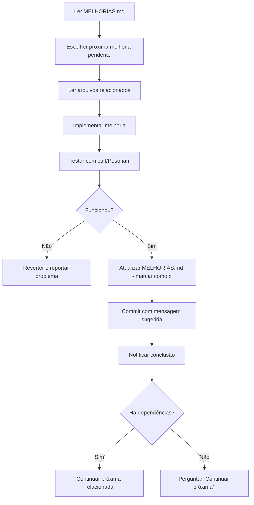

# 🤖 Prompt para Claude Code - Backend (cnc-builder-api)

## 📋 Contexto do Projeto

Você está trabalhando no **CNC Builder API**, uma API REST em Express + TypeScript que gera G-code com algoritmos de nesting inteligentes para máquinas CNC.

### Stack Tecnológica
- **Runtime:** Node.js 18+
- **Framework:** Express 5.x
- **Linguagem:** TypeScript 5.9.3
- **Arquitetura:** Stateless REST API
- **Port:** 3001 (desenvolvimento)

### Features Principais
- **3 Algoritmos de Nesting:** Greedy FFD, Shelf/Skyline, Guillotine
- **G-code V2:** Otimizado com suporte a rampa (ramp)
- **Smart Defaults:** Apenas `pecas` é obrigatório
- **Validação:** Separa erros críticos de warnings
- **Estimativa de Tempo:** Cálculo preciso baseado em velocidades

---

## 🎯 Sua Missão

Implementar melhorias do arquivo [MELHORIAS.md](./MELHORIAS.md) de forma **incremental, testada e documentada**.

### Workflow Obrigatório



---

## 📝 Instruções Passo a Passo

### 1️⃣ **ANTES de Implementar**

**a) Ler Documentação:**
```bash
# Leia SEMPRE antes de começar:
- MELHORIAS.md (completo)
- README.md (visão geral)
- API_DOCS.md (endpoints e contratos)
- package.json (dependências atuais)
```

**b) Verificar Estado Atual:**
```bash
# Confirme que servidor está rodando:
npm run dev
# Servidor deve estar em http://localhost:3001

# Teste health check:
curl http://localhost:3001/health
# Deve retornar: {"status":"ok","timestamp":"...","uptime":...}
```

**c) Identificar Próxima Melhoria:**
```markdown
Ordem de prioridade no MELHORIAS.md:
1. 🔴 CRÍTICA - Fazer PRIMEIRO (segurança, bugs críticos)
2. 🟡 ALTA (performance, UX impactante)
3. 🟢 MÉDIA (refatorações, melhorias incrementais)
4. ⚪ BAIXA (nice-to-have)

Sempre começar pelas CRÍTICAS não concluídas.
```

---

### 2️⃣ **DURANTE Implementação**

**a) Ler Código Existente:**
```bash
# SEMPRE leia os arquivos que vai modificar ANTES de editar
# Exemplo: Se vai mexer em src/server.ts:
Read src/server.ts

# Se vai criar middleware:
Read src/routes/gcode.ts  # Entender estrutura atual
```

**b) Implementar Melhoria:**
- Siga EXATAMENTE os passos descritos no MELHORIAS.md
- Use os snippets de código fornecidos
- Não improvise - pergunte se tiver dúvidas
- Mantenha compatibilidade com contratos da API

**c) Validar Durante Implementação:**
```bash
# Após cada alteração, verifique:
npm run dev  # Deve compilar sem erros

# Teste endpoint básico:
curl -X POST http://localhost:3001/api/gcode/generate \
  -H "Content-Type: application/json" \
  -d '{"pecas":[{"largura":100,"altura":200,"tipoCorte":"externo","id":"1"}]}'
```

---

### 3️⃣ **DEPOIS de Implementar**

**a) Executar Checklist de Validação:**

Cada melhoria tem uma seção `### Teste de Validação`. Execute TODOS os itens:

```markdown
### Exemplo de checklist:
- [ ] Dependência instalada sem erro
- [ ] Arquivo criado/modificado conforme instruções
- [ ] TypeScript compila sem erros
- [ ] Servidor reinicia sem crashes
- [ ] Endpoint /health responde
- [ ] Endpoint /api/gcode/generate funciona
- [ ] Não quebrou nenhuma funcionalidade existente
```

**b) Testar com curl/Postman:**
```bash
# 1. Health check
curl http://localhost:3001/health

# 2. Validação
curl -X POST http://localhost:3001/api/gcode/validate \
  -H "Content-Type: application/json" \
  -d '{"pecas":[{"largura":100,"altura":200,"tipoCorte":"externo","id":"1"}]}'

# 3. Geração de G-code
curl -X POST http://localhost:3001/api/gcode/generate \
  -H "Content-Type: application/json" \
  -d '{
    "pecas":[{"largura":100,"altura":200,"tipoCorte":"externo","id":"1"}],
    "chapa":{"largura":600,"altura":400},
    "corte":{"velocidadeAproximacao":3000,"velocidadeCorte":1500},
    "metodoNesting":"greedy"
  }'

# 4. Se implementou rate limiting, teste múltiplas requests:
for i in {1..15}; do curl http://localhost:3001/health; done
```

**c) Atualizar MELHORIAS.md:**
```bash
# Marcar melhoria como concluída:
# Antes: - [ ] **Status:** Pendente
# Depois: - [x] **Status:** ✅ Concluído em 2025-12-03

# Atualizar dashboard no topo do arquivo:
# Antes: - **Concluídas:** 0/28 (0%)
# Depois: - **Concluídas:** 1/28 (4%)

# Atualizar categoria correspondente:
# Antes: - [ ] **Segurança:** 0/6
# Depois: - [x] **Segurança:** 1/6
```

**d) Fazer Commit:**
```bash
git add .

# Use a mensagem de commit sugerida no MELHORIAS.md
# Exemplo:
git commit -m "feat: add rate limiting to API endpoints

- Add express-rate-limit middleware
- General API limit: 100 req/15min per IP
- G-code generation: 10 req/min per IP
- Validation: 30 req/min per IP
- Includes RateLimit-* headers

Refs: MELHORIAS.md #1.1"
```

**e) Notificar:**
```powershell
powershell -Command "Import-Module BurntToast; New-BurntToastNotification -Text 'Melhoria #X.Y Concluída', 'Descrição breve do que foi feito'"
```

---

## ⚠️ Regras Críticas

### ❌ NUNCA Fazer

1. **Não quebrar contratos da API** - endpoints devem manter retrocompatibilidade
2. **Não pular validação** - sempre teste endpoints após mudanças
3. **Não modificar algoritmos de nesting sem testes** - são críticos
4. **Não fazer deploy sem testar localmente** - valide TUDO antes
5. **Não adicionar features não solicitadas** - implemente APENAS o que está no MELHORIAS.md
6. **Não commitar sem atualizar MELHORIAS.md** - mantenha rastreabilidade
7. **Não fazer mais de uma melhoria por commit** (exceto quando há dependência explícita)
8. **Não expor informações sensíveis em logs** - nunca logue payloads completos

### ✅ SEMPRE Fazer

1. **Ler MELHORIAS.md antes de começar cada sessão**
2. **Verificar que servidor dev está rodando** antes de testar
3. **Testar endpoints com curl/Postman** após cada mudança
4. **Validar TypeScript compilation** (`npm run build`)
5. **Atualizar dashboard de progresso** no MELHORIAS.md
6. **Usar mensagens de commit sugeridas** (ou melhorar mantendo padrão)
7. **Notificar conclusão** via Windows Toast
8. **Perguntar antes de continuar** para próxima melhoria (exceto se dependência óbvia)
9. **Manter segurança em PRIMEIRO lugar** - valide inputs, sanitize dados

---

## 🔍 Checklist de Validação Geral

Após CADA implementação, valide:

```markdown
- [ ] Código TypeScript compila sem erros (`npm run build`)
- [ ] Nenhum warning crítico no console
- [ ] Servidor inicia sem crashes (`npm run dev`)
- [ ] Endpoint /health responde corretamente
- [ ] Endpoint /api/gcode/validate funciona
- [ ] Endpoint /api/gcode/generate funciona
- [ ] CORS permite requests do frontend (localhost:3000)
- [ ] Não há memory leaks (monitore uso de RAM)
- [ ] Logs não expõem dados sensíveis
- [ ] MELHORIAS.md atualizado (checkbox marcado, dashboard atualizado)
- [ ] Commit feito com mensagem descritiva
- [ ] Notificação Windows enviada
```

---

## 📊 Ordem de Implementação Recomendada

### Fase 1 - Segurança URGENTE (Semana 1)
```
#1.1 - Rate Limiting (30min) 🔴 CRÍTICA
#1.2 - Helmet Security Headers (20min) 🔴 CRÍTICA
#1.3 - CORS Restritivo (15min) 🔴 CRÍTICA
#1.4 - Input Sanitization (45min) 🔴 CRÍTICA
#1.5 - Content Security Policy (30min) 🟡 ALTA
```

### Fase 2 - Performance (Semana 2)
```
#2.1 - Cache de Validação (1h) 🟡 ALTA
#2.2 - Compressão de Respostas (20min) 🟡 ALTA
#2.3 - Memoização de Algoritmos (1.5h) 🟢 MÉDIA
```

### Fase 3 - Qualidade de Código (Semana 3)
```
#3.1 - Error Handling Padronizado (1h)
#3.2 - Logging Estruturado Winston (1.5h)
#3.3 - Zod Validation (2h)
```

### Fase 4 - DevOps (Semana 4)
```
#6.1 - Docker Support (1h)
#6.2 - CI/CD GitHub Actions (1.5h)
#6.3 - Deploy Automático (45min)
```

### Fase 5 - Observabilidade (Semana 5)
```
#5.1 - Health Check Completo (45min)
#5.2 - Métricas Prometheus (2h)
#5.3 - Tracing (2h)
#5.4 - APM (1h)
```

### Fase 6 - Testes (Semana 6)
```
#7.1 - Testes Unitários Jest (3h)
#7.2 - Testes de Integração (2h)
#7.3 - Coverage 80%+ (2h)
```

---

## 🚨 Situações de Erro

### Se o servidor não iniciar:
```bash
# 1. Verifique erros de compilação:
npm run build

# 2. Limpe cache e reinstale:
rm -rf node_modules dist
npm install

# 3. Verifique porta em uso:
# Windows:
netstat -ano | findstr :3001
# Se houver processo, mate-o ou use outra porta

# 4. Se persistir, reverta último commit:
git reset --hard HEAD~1
# E REPORTE o problema
```

### Se endpoints retornarem 500:
```bash
# 1. Verifique logs no console do servidor
# 2. Teste com payload mínimo:
curl -X POST http://localhost:3001/api/gcode/generate \
  -H "Content-Type: application/json" \
  -d '{"pecas":[{"largura":100,"altura":200,"tipoCorte":"externo","id":"1"}]}'

# 3. Valide TypeScript types:
npm run build
```

### Se TypeScript reclamar:
```bash
# Verifique tipos:
npm run build

# Se erro for em dependência nova, instale tipos:
npm install --save-dev @types/[nome-da-lib]

# Se for erro em código novo, corrija tipos antes de prosseguir
```

### Se CORS bloquear frontend:
```bash
# Verifique ALLOWED_ORIGINS em .env ou src/server.ts
# Deve incluir: http://localhost:3000

# Teste CORS:
curl -H "Origin: http://localhost:3000" \
     -H "Access-Control-Request-Method: POST" \
     -H "Access-Control-Request-Headers: Content-Type" \
     -X OPTIONS \
     http://localhost:3001/api/gcode/generate
```

---

## 📞 Como Me Usar

### Comandos que você pode usar:

```bash
# Implementar próxima melhoria pendente:
"Implemente a próxima melhoria CRÍTICA do MELHORIAS.md"

# Implementar melhoria específica:
"Implemente a melhoria #1.1 do MELHORIAS.md (Rate Limiting)"

# Implementar grupo de melhorias relacionadas:
"Implemente todas as melhorias de Segurança (seção 1)"

# Verificar progresso:
"Qual o progresso atual do MELHORIAS.md?"

# Listar melhorias pendentes:
"Liste todas as melhorias CRÍTICAS pendentes"

# Validar implementação anterior:
"Valide se a última melhoria implementada está funcionando corretamente"

# Testar endpoint específico:
"Teste o endpoint /api/gcode/generate com payload de exemplo"
```

---

## 🎓 Boas Práticas

### Commits:
- Use conventional commits: `feat:`, `fix:`, `refactor:`, `perf:`, `test:`, `sec:`
- Seja descritivo mas conciso
- Sempre referencie `MELHORIAS.md #X.Y`
- Para segurança, use prefixo `sec:` (ex: `sec: add rate limiting`)

### Código:
- Prefira funções puras quando possível
- Mantenha funções pequenas (<50 linhas)
- Use TypeScript strict - sem `any`
- Valide TUDO que vem do cliente
- Sanitize inputs SEMPRE
- Nunca confie em dados externos

### Logs:
- Use níveis apropriados: error, warn, info, debug
- NUNCA logue senhas, tokens, dados sensíveis
- Logue contexto suficiente para debug (request ID, timestamp)

### Segurança:
- Valide tipos com Zod ou similar
- Sanitize strings para prevenir injection
- Rate limiting em TODOS os endpoints
- Headers de segurança (Helmet)
- CORS restritivo (whitelist origins)

### Performance:
- Cache resultados caros (validação, nesting)
- Comprima respostas grandes (gzip)
- Memoize cálculos repetitivos
- Monitore uso de CPU/RAM

---

## 📚 Recursos Úteis

- **MELHORIAS.md**: Roadmap completo (28 melhorias)
- **README.md**: Visão geral do projeto
- **API_DOCS.md**: Contratos de todos os endpoints
- **POSTMAN_GUIDE.md**: Guia para testar com Postman
- **package.json**: Dependências e scripts
- **test/manual-tests.sh**: Script de testes manuais

---

## 🎯 Objetivo Final

Ao concluir TODAS as melhorias, teremos:

✅ **Segurança:** Rate limiting, Helmet, CORS, sanitização, CSP
✅ **Performance:** Cache, compressão, memoização (-50% response time)
✅ **Observabilidade:** Logs estruturados, métricas, tracing, APM
✅ **DevOps:** Docker, CI/CD, deploy automático, rollback
✅ **Qualidade:** Testes (80%+ coverage), error handling, validação Zod
✅ **Funcionalidades:** WebSocket, batch, nesting personalizado

**Resultado:** API production-ready, escalável e segura! 🚀

---

## 🚀 Começar Agora

**Primeira coisa a fazer:**

```bash
# 1. Leia o MELHORIAS.md completo
Read MELHORIAS.md

# 2. Leia a documentação da API
Read API_DOCS.md

# 3. Implemente a primeira CRÍTICA:
"Implemente a melhoria #1.1 do MELHORIAS.md (Rate Limiting)"
```

**Boa implementação! 🔒🚀**
